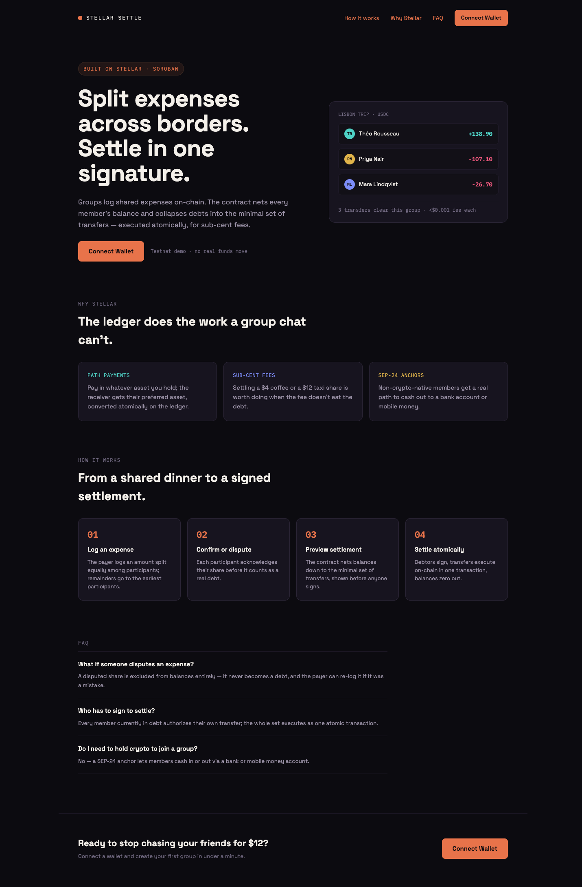
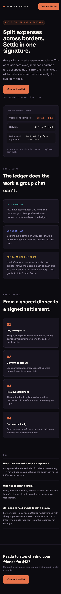
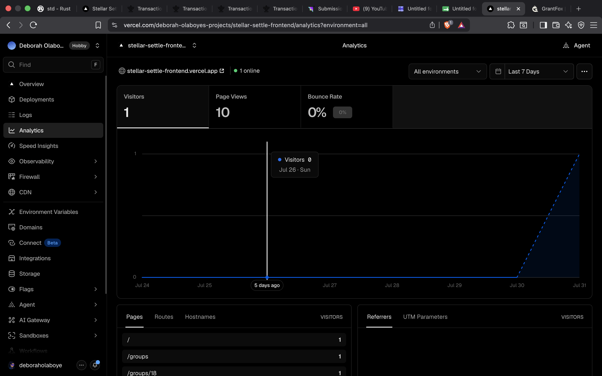

# stellar-settle

Cross-border group expense splitting on Stellar. Groups log shared expenses,
the contract tracks net balances per member and settling collapses those
balances into a minimal set of token transfers executed atomically on-chain.

Built for the Stellar Journey to Mastery builder challenge (Level 4).

**Live app:** https://stellar-settle-frontend.vercel.app/

**Demo video:** https://youtu.be/oZXtlh4Xn4k

**Feedback form:** https://docs.google.com/forms/d/e/1FAIpQLSeaFS7Um-dxvSLKnls-A1NMGxn9PCJOzIC8_3GfqzZ4lVXihw/viewform

**Contract Address (testnet):** `CDPWFPPALHB66OZS3LFS35GKAYD3GM5LU4DZH6XVYBXJUSTSIDCWIM7R`

## Why Stellar

- **Path payments** let a payer settle in whatever asset they hold while the
  receiver gets their preferred asset, converted atomically on the ledger.
- **Sub-cent fees** make settling small line items (a $4 coffee, a $12 taxi
  share) economically worth doing instead of letting debts linger.
- **Anchors (SEP-24)** could give non-crypto-native group members a path to
  cash out to a bank or mobile money account — planned (see Roadmap), not
  built yet. Nothing in the current app claims this is live.

## Project structure

```text
.
├── contracts
│   └── settlement
│       ├── src
│       │   ├── lib.rs        # contract entry points
│       │   ├── types.rs      # Group, Expense, Transfer, storage keys
│       │   ├── group.rs      # group creation/lookup, member->groups index
│       │   ├── expense.rs    # expense logging + confirm/dispute
│       │   ├── balances.rs   # per-member net balance storage
│       │   ├── netting.rs    # minimal transfer set (debt-netting) algorithm
│       │   └── settle.rs     # settlement execution via token transfers
│       └── Cargo.toml
├── packages
│   ├── settlement-client      # generated TS bindings for the settlement contract
│   └── token-client            # generated TS bindings for the demo SETL token
├── frontend                    # Next.js frontend (App Router)
├── Cargo.toml
├── package.json                # npm workspace root
└── README.md
```

## Contract flow

1. `create_group` — a group is settled in a single asset (its `token`); the
   creator must be one of the members.
2. `log_expense` — the payer logs an amount split equally among
   participants, with any remainder distributed to the earliest
   participants so shares always sum exactly to the amount. The expense
   does not affect balances yet.
3. `confirm_expense` / `dispute_expense` — each participant acknowledges
   their share (applying it to net balances) or disputes it (excluding it).
   This is the confirmation window: a logged expense isn't a real debt
   until the person who owes it agrees.
4. `preview_settlement` — read-only computation of the minimal transfer set
   for a group's current balances, for a frontend to show before anyone
   signs.
5. `settle` — executes that transfer set as token transfers and zeroes the
   group's balances. Each debtor's `require_auth` is enforced inside the
   token transfer, so in a real transaction this is submitted with
   authorization entries from every member currently in debt, not just the
   caller.

Every state-changing call (`create_group`, `log_expense`, `confirm_expense`,
`dispute_expense`, and each transfer inside `settle`) emits an on-chain event,
so the frontend's Activity feed can show a real, permanent transaction link
for every action — not just a toast that disappears after a few seconds.

**Note:** the contract was redeployed once, specifically to add this event
logging — Soroban contracts can only be upgraded in place if they shipped
with an upgrade function from day one, which this one didn't.

- Old contract (no events, no longer used): `CCFOZE4G2B6ZNUWSMFAMJA6WAFZMLUOMIXZMJV3N3Y75TVIC3PO2SRCB`
- Current contract (with events): `CDPWFPPALHB66OZS3LFS35GKAYD3GM5LU4DZH6XVYBXJUSTSIDCWIM7R`

Groups created against the old contract ID are still on the ledger but are no
longer reachable from this app — that data wasn't deleted, just orphaned.

## Development

```bash
cargo test -p settlement    # unit + integration tests
stellar contract build      # build the wasm target
```

`soroban-sdk` is pinned to `22.0.11` — newer releases (25.x, 27.0.0) fail to
compile with the `testutils` feature due to an upstream dependency conflict
between `ed25519-dalek` and `rand_core` in `soroban-env-host`.

## Frontend

Deployed on testnet:

- Settlement contract: `CDPWFPPALHB66OZS3LFS35GKAYD3GM5LU4DZH6XVYBXJUSTSIDCWIM7R`

```bash
npm install                          # from repo root, installs the workspace
npm run build -w packages/settlement-client
npm run build -w packages/token-client
npm run dev -w frontend               # http://localhost:3000
```

To try it: install the [Freighter](https://www.freighter.app/) wallet extension,
switch it to Testnet, and fund your account via
[Friendbot](https://laboratory.stellar.org/#account-creator?network=test). That
funds you with XLM, which is also the default settlement token — no separate
faucet or minting step needed to create a group or settle up. (A custom demo
token, SETL, and its issuer key still exist and can be selected via "Other..."
in the token picker, but nothing in the app depends on it anymore.)

The settle flow requires an auth-entry signature from every member currently
in debt, not just whoever clicks "Confirm & settle" — in the demo, switch
Freighter's active account between each debtor's signature.

## Screenshots

| Desktop | Mobile |
| --- | --- |
|  |  |

All screenshots are pulled from the live deployment with real wallets and
real on-chain data — no fabricated groups, balances, or names.

### Full real user journey (two real wallets, testnet)

[docs/screenshots/connected-app/](docs/screenshots/connected-app/) walks through
an entire real session end to end:

1. [Groups dashboard](docs/screenshots/connected-app/01-groups-dashboard.png)
2. [Group balances (empty)](docs/screenshots/connected-app/02-group-balances-empty.png)
3. [Log expense form](docs/screenshots/connected-app/06-log-expense-form.png) — correct
   per-person split, payer included
4. [Expenses tab, pending confirmation](docs/screenshots/connected-app/04-expenses-tab-pending.png)
5. [Confirming as the payer](docs/screenshots/connected-app/03-confirm-as-payer.png) —
   net-zero balance change, clearly explained
6. [Same expense from the second real wallet](docs/screenshots/connected-app/07-expenses-second-wallet-view.png)
7. [Confirming as the second wallet](docs/screenshots/connected-app/08-confirm-as-second-wallet.png) —
   "Confirm — I owe this"
8. [Expenses tab, fully confirmed](docs/screenshots/connected-app/09-expenses-fully-confirmed.png)
9. [Balances updated for real](docs/screenshots/connected-app/10-balances-updated.png) —
   +100.00 / -100.00
10. [Settlement preview](docs/screenshots/connected-app/11-settle-preview.png) — minimal
    transfer set
11. [Settlement confirmed](docs/screenshots/connected-app/12-settle-confirmed.png) —
    real transaction hash
12. [Verified on Stellar Expert](docs/screenshots/connected-app/13-verified-onchain-transaction.png) —
    the actual `settle` invocation and transfer, independently confirmed on-chain

### Same journey, mobile viewport

[docs/screenshots/connected-app-mobile/](docs/screenshots/connected-app-mobile/) is a
second full real session end to end, at mobile width, on a different group:

1. [Groups dashboard](docs/screenshots/connected-app-mobile/01-groups-dashboard.png)
2. [Create group](docs/screenshots/connected-app-mobile/02-create-group.png)
3. [Group balances (empty)](docs/screenshots/connected-app-mobile/03-group-balances-empty.png)
4. [Log expense form](docs/screenshots/connected-app-mobile/04-log-expense-form.png)
5. [Expenses tab, pending](docs/screenshots/connected-app-mobile/05-expenses-tab-pending.png)
6. [Confirming as the payer](docs/screenshots/connected-app-mobile/06-confirm-as-payer.png)
7. [1/2 confirmed](docs/screenshots/connected-app-mobile/07-expenses-1of2-confirmed.png)
8. [Same expense from the second real wallet](docs/screenshots/connected-app-mobile/08-second-wallet-review.png)
9. [Fully confirmed](docs/screenshots/connected-app-mobile/09-expenses-fully-confirmed.png)
10. [Balances updated for real](docs/screenshots/connected-app-mobile/10-balances-updated.png)
11. [Settlement preview](docs/screenshots/connected-app-mobile/11-settle-preview.png)
12. [Settlement confirmed](docs/screenshots/connected-app-mobile/12-settle-confirmed.png) —
    a second, independent real transaction hash

## Product quality

- **Monitoring/analytics:** Vercel Analytics and Speed Insights are wired
  into the root layout. Custom events (`wallet_connected`, `group_created`,
  `expense_logged`, `expense_confirmed`, `expense_disputed`,
  `settlement_completed`) track the core flows from the Vercel dashboard.
- **Feedback collection:** a "Send feedback" link in the sidebar opens a
  short form (falls back to a `mailto:` link if `NEXT_PUBLIC_FEEDBACK_FORM_URL`
  isn't set).
- **Mobile responsive:** the connected app's sidebar collapses into a
  top bar below the `md` breakpoint, and the landing page reflows to a
  single column with no horizontal overflow at 390px-wide viewports.
- **Loading/error states:** every async screen (groups, balances,
  expenses, settlement preview) has a loading state, and failures surface
  as a toast rather than a silent failure.
- **Durable transaction history:** every group page has an Activity feed
  reading real on-chain events (group created, expenses logged/confirmed/
  disputed, settlements) with a permanent Stellar Expert link per action —
  not just a toast that's gone once you navigate away.

### Feedback highlights

- **Positive:** UI/UX is consistently praised as clean and easy to use.
- **Feature requests:** add more supported tokens, allow adding more users after group creation, show transaction links more prominently, add a transactions history page.
- **Usability:** most users found completing actions (connect, sign, settle) straightforward (rated 4–5/5). One user was confused by the settlement-token requirement (XLM starts with `G`, but the contract expects the token contract address starting with `C`) — this is now documented.

### Key user journeys verified

- Multi-signature settle flow: users completed the full flow (create → log → confirm → settle) with both wallets signing.
- Expense confirmation/dispute: multiple users confirmed and disputed shares.
- Mobile: full journeys completed at mobile viewport width (`docs/screenshots/connected-app-mobile/`).

### Vercel Analytics dashboard



## User feedback & real-user proof (Level 4 submission)

**11 unique wallet addresses** interacted with the live app on testnet
between 2026-07-26 and 2026-07-29, each completing at least one of:
connect wallet, create group, log expense, confirm/dispute expense, settle up.
Feedback was collected via the in-app Google Form.

> 👉 **Verify On-Chain**: [View all transactions and contract activity on Stellar.Expert](https://stellar.expert/explorer/testnet/contract/CDPWFPPALHB66OZS3LFS35GKAYD3GM5LU4DZH6XVYBXJUSTSIDCWIM7R)

These are the 11 public addresses of the users who successfully interacted with the Stellar Settle smart contract, verified via on-chain activity and collected feedback:

1. `GDGQ3EDSG4TVF3V23WKWV2QCCGPGLRFS5HVD37SGXQ57E6JNUICKEEOB` - John - [🔍 Verify Account](https://stellar.expert/explorer/testnet/account/GDGQ3EDSG4TVF3V23WKWV2QCCGPGLRFS5HVD37SGXQ57E6JNUICKEEOB)
2. `GCKIYKVSULULAU7BAERAEWVPZ3QX6UIXZVHH27LJ2ULLU43LL6SJQS6X` - Victor - [🔍 Verify Account](https://stellar.expert/explorer/testnet/account/GCKIYKVSULULAU7BAERAEWVPZ3QX6UIXZVHH27LJ2ULLU43LL6SJQS6X)
3. `GA7UI5WKPENBFYXPFTSEF6XPATACL7XH43RUO5HYZGFS4XR2WMBVDVGL` - gold andrew - [🔍 Verify Account](https://stellar.expert/explorer/testnet/account/GA7UI5WKPENBFYXPFTSEF6XPATACL7XH43RUO5HYZGFS4XR2WMBVDVGL)
4. `GDK44RVCCQQA4HPNUFRZVALD7KRMAH5VG3IY2HL6IDOCXRVUGTOZ6F34` - Johnson - [🔍 Verify Account](https://stellar.expert/explorer/testnet/account/GDK44RVCCQQA4HPNUFRZVALD7KRMAH5VG3IY2HL6IDOCXRVUGTOZ6F34)
5. `GDVIBVLH7IJUAJL4QNQRXWY262WQ6BLSGUFJV2HDXDGKDCUDDVYRDNWW` - Rebecca - [🔍 Verify Account](https://stellar.expert/explorer/testnet/account/GDVIBVLH7IJUAJL4QNQRXWY262WQ6BLSGUFJV2HDXDGKDCUDDVYRDNWW)
6. `GAL7QADSB7IKGCAZKZGDLRTH42KBRFC3VCOKELDOFE3SWIRAWOWTFWIH` - Pelumi Osas - [🔍 Verify Account](https://stellar.expert/explorer/testnet/account/GAL7QADSB7IKGCAZKZGDLRTH42KBRFC3VCOKELDOFE3SWIRAWOWTFWIH)
7. `GDRPRELYBUZSIQ4OFBJVUYSSAB4RK3JIBBI34Q6NH2Q576CSMXMEHYAD` - [🔍 Verify Account](https://stellar.expert/explorer/testnet/account/GDRPRELYBUZSIQ4OFBJVUYSSAB4RK3JIBBI34Q6NH2Q576CSMXMEHYAD)
8. `GCSUKZSISNFDTCYEJ7OYO2A3DAKFKRISFZLKKZKQUVHP624W5TBNDOKH` - Deja - [🔍 Verify Account](https://stellar.expert/explorer/testnet/account/GCSUKZSISNFDTCYEJ7OYO2A3DAKFKRISFZLKKZKQUVHP624W5TBNDOKH)
9. `GCT6OIHMNJ5OVNWYERFULDDM7OJZIOUYAXU6MKSWCD32WMQBVDPKXOSW` - [🔍 Verify Account](https://stellar.expert/explorer/testnet/account/GCT6OIHMNJ5OVNWYERFULDDM7OJZIOUYAXU6MKSWCD32WMQBVDPKXOSW)
10. `GD72SIUBU2LGDMV26S2DU56A5XR6KNB5GKJOPXWY44Z2O7DEFO2UDZBR` - Emmanuel - [🔍 Verify Account](https://stellar.expert/explorer/testnet/account/GD72SIUBU2LGDMV26S2DU56A5XR6KNB5GKJOPXWY44Z2O7DEFO2UDZBR)
11. `GDZ4VJWNJPLNU3PAWDYX3V5XNATO7X257DPHWRPFXSCCNEUZ7QTXIIUI` - Ruth Peace - [🔍 Verify Account](https://stellar.expert/explorer/testnet/account/GDZ4VJWNJPLNU3PAWDYX3V5XNATO7X257DPHWRPFXSCCNEUZ7QTXIIUI)

## Product quality

- **Monitoring/analytics:** Vercel Analytics and Speed Insights are wired
  into the root layout. Custom events (`wallet_connected`, `group_created`,
  `expense_logged`, `expense_confirmed`, `expense_disputed`,
  `settlement_completed`) track the core flows from the Vercel dashboard.
- **Feedback collection:** a "Send feedback" link in the sidebar opens a
  short form (falls back to a `mailto:` link if `NEXT_PUBLIC_FEEDBACK_FORM_URL`
  isn't set).
- **Mobile responsive:** the connected app's sidebar collapses into a
  top bar below the `md` breakpoint, and the landing page reflows to a
  single column with no horizontal overflow at 390px-wide viewports.
- **Loading/error states:** every async screen (groups, balances,
  expenses, settlement preview) has a loading state, and failures surface
  as a toast rather than a silent failure.
- **Durable transaction history:** every group page has an Activity feed
  reading real on-chain events (group created, expenses logged/confirmed/
  disputed, settlements) with a permanent Stellar Expert link per action —
  not just a toast that's gone once you navigate away.
